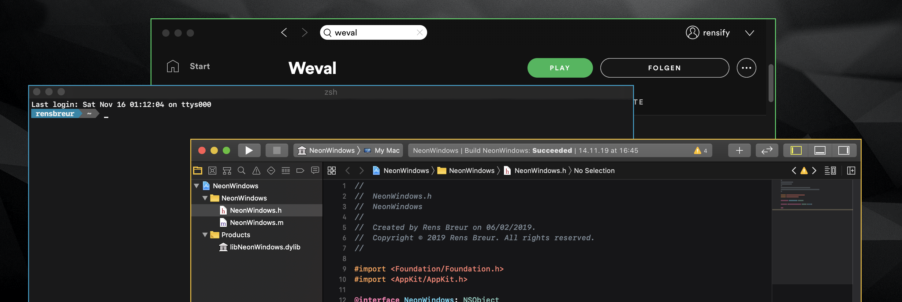

# NeonWindows



NeonWindows is a plugin to color window border colors on macOS Catalina.

```
defaults write -app MyApp "cr" {red_value}
defaults write -app MyApp "cg" {green_value}
defaults write -app MyApp "cb" {blue_value}
```
